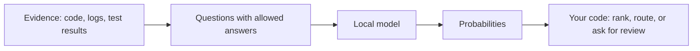

# Jev concepts, explained for developers

You only need to understand JSON and ordinary application code to use this project.
Start with a decision your program needs to make, then supply the evidence needed to make it.

## Why put a model inside an if statement?

Some decisions are exact: did a process exit with code zero? Use normal code for those.
Other decisions involve meaning: does this function silently hide a failure, or does this log explain the broken build?
Those are useful places to try a model.

An agent that writes code repeatedly chooses what to read, what to investigate, and whether its work is complete.
A small decision can help direct that loop before the agent spends time writing a long response.
You still need to measure whether that decision improves your particular workflow.



The model supplies judgments. Your code owns the policy and the action.
For example, ranking likely relevant functions changes what the agent reads first; it does not prove those functions contain a bug.

## What is Jev?

[Jev](https://docs.typesafe.ai/introduction) is TypeSafe's decision model and hosted API.
You give it evidence and bounded questions. It returns structured answers and probabilities.
Its `/v1/systemone` name refers to this decision API; you do not need another service called “System One.”

TypeSafe describes training Jev with **reinforcement learning for calibrated decisions**, abbreviated **RLCD**.
The intended result is probabilities that track observed outcomes across many cases.
This is a training objective, not something a JSON schema can provide.
See [TypeSafe's training explanation](https://docs.typesafe.ai/introduction/machine-learning-primer).

**This repository runs a different model: DiffusionGemma.** It borrows the question-and-answer interface and implements a local subset.
It does not contain Jev's weights or reproduce Jev's training.
The same response shape therefore does not imply the same quality, calibration, or speed.

## State: the evidence for this request

`state` is the material you want judged: a function, a diff, a log bundle, or a ticket with relevant tests.
It can be a string, object, or list. Use named fields when they make relationships clearer.

```json
{
  "requirement": "Reject empty email addresses.",
  "patch": "if not email: raise ValueError('email required')",
  "tests": ["test_valid_email passes"],
  "test_run": "1 passed"
}
```

This evidence supports “a guard was added.” It does not show a test of the empty-input case.
A useful decision asks about that missing evidence instead of accepting an agent's statement that the task is done.

The server does not read your disk or remember earlier requests.
If a judgment needs a requirement, caller, or earlier result, include it in the state.
This follows the general [state-and-questions pattern](https://docs.typesafe.ai/concepts/state).

## Questions: what you want to know

Each question has an ID, a type, and instructions. Some types also need `criteria`, meaning the allowed answers.
IDs such as `regression_test` let your code find the response. Put the actual meaning in the instructions.

Ask one clearly defined thing at a time. “Is this code good?” leaves too much unspecified.
“Does a supplied test call this function with an empty email?” gives the model a checkable task.

## Noul: a yes/no question that returns a number

**Noul** is Jev's name for the probability of “yes.” Say what “yes” means in the question.

```json
{
  "type": "noul",
  "instructions": "Does a supplied test exercise the empty-email case?"
}
```

An illustrative answer is `{"type": "noul", "noul": 0.12}`.
Values near 1 favor yes; values near 0 favor no. A value near 0.5 gives both answers similar weight.
It does not mean the feature is “half implemented.”

Your code can rank functions by this number or apply a threshold.
The demos use explicit thresholds as teaching examples, not validated production settings.

Like native Jev, you can also spell out what each side means with `criteria`.
Supply both sides or neither:

```json
{
  "type": "noul",
  "instructions": "Does a supplied test exercise the empty-email case?",
  "criteria": {
    "true": "A supplied test calls the function with an empty email.",
    "false": "No supplied test covers that input."
  }
}
```

See the [official Noul definition](https://docs.typesafe.ai/primitives/noul).

## Choice: pick one of the options you supply

Use Choice for alternatives such as “dependency problem,” “assertion failure,” or “network failure.”
The local API supports **2–26 alternatives**.

```json
{
  "type": "choice",
  "instructions": "Which next step best fits the supplied failure?",
  "criteria": {
    "dependencies": "Inspect the missing package and environment setup.",
    "implementation": "Inspect a failed behavior assertion and its implementation.",
    "more_evidence": "The evidence does not identify either cause."
  }
}
```

The answer includes the selected key and a probability for every key.
Those probabilities add to one, so the alternatives compete.
Include an escape option when your list might omit the right answer.

Choice asks which option is most plausible **among those offered**.
It cannot establish that the winning option is valid in the wider world.
See the [official Choice definition](https://docs.typesafe.ai/primitives/choice).

## Score: place something on a described scale

Use Score when the levels have an order. Write descriptions before choosing numbers.
The local API accepts **2–10 levels**, numbered from zero.

```json
{
  "type": "score",
  "instructions": "How useful is this log record for explaining the current failure?",
  "criteria": [
    "Routine information with no evidence about the failure.",
    "Related symptom that may help narrow the investigation.",
    "Specific failure evidence that directly guides investigation."
  ]
}
```

Suppose the probabilities for levels 0, 1, and 2 are `0.1`, `0.6`, and `0.3`.
The returned score is `0×0.1 + 1×0.6 + 2×0.3 = 1.2`.
This is a **weighted average**, not a percentage and not necessarily the most likely level.
Here, the most likely level is 1.

The response includes `legend`, which maps indices back to descriptions.
The local model considers these levels together. Native Jev evaluates levels using different conditioning, so these scores are not numerically interchangeable.
See [TypeSafe's Score contract](https://docs.typesafe.ai/primitives/score).

## Probability, confidence, and being right are different

A probability of `0.9` means this local readout favors an answer strongly.
It does **not** establish a measured 90% chance of correctness.

**Calibration** means predictions agree with observed rates across a labeled dataset.
For example, among many predictions around 0.8, roughly 80% should be true.
We have not established that property for this model and interface.

Choice and Score also return `confidence`.
It is the gap between the two highest probabilities: zero when the top two tie, one when all weight is on one answer.
A confidently wrong answer remains possible. Noul has no separate confidence field.

Use held-out examples from your workflow to choose thresholds.
Keep a fallback for uncertain answers, failed requests, and missing evidence.
TypeSafe's [confidence guide](https://docs.typesafe.ai/confidence) describes its own contract; every hosted answer we probed matched this same top-two gap, but TypeSafe does not publish the formula, so the match is observed rather than promised.

## Asking several questions together

A request can contain **1–32 questions** sharing the same state.
For a log record, you could ask whether it is actionable, which team should inspect it, and how useful it is.

The default local mode, `packed`, evaluates questions together. Their presence and order can affect other answers.
With `options.mode: "independent"`, each question gets a separate model evaluation and costs more time.
Even that mode does not reproduce every native Jev behavior.

If question B requires the answer to question A, use two requests.
Read A in your code, add the needed result to the next state, then ask B.

## What happens inside the local model?

The model first reads the state and questions. It then evaluates short answer positions containing permitted labels.
The server reads the model's numerical preferences for those labels and converts them into probabilities.
Python constructs the response JSON, so there is no generated prose to extract or repair.

An optional experimental startup setting lets the model generate internal
reasoning before those decisions. It stays off by default and can make responses
much slower. The API still returns typed answers, and the reasoning text stays
inside the running process. See [experimental reasoning](setup.md#experimental-reasoning).

**DiffusionGemma** is the model doing those calculations.
**MLX** runs them on Apple Silicon. **OptiQ** loads this compressed version of the model.
**4-bit** describes how most model weights are stored compactly; it does not mean answers have only four possible values.

You do not need these implementation details to call the API.
For answer canvases, noise samples, optimizations, and exact differences from native Jev, read [the implementation notes](research.md).
